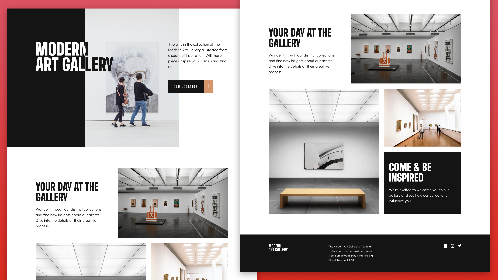
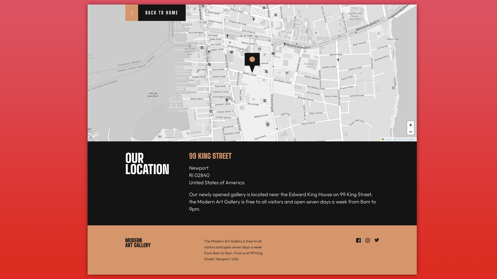
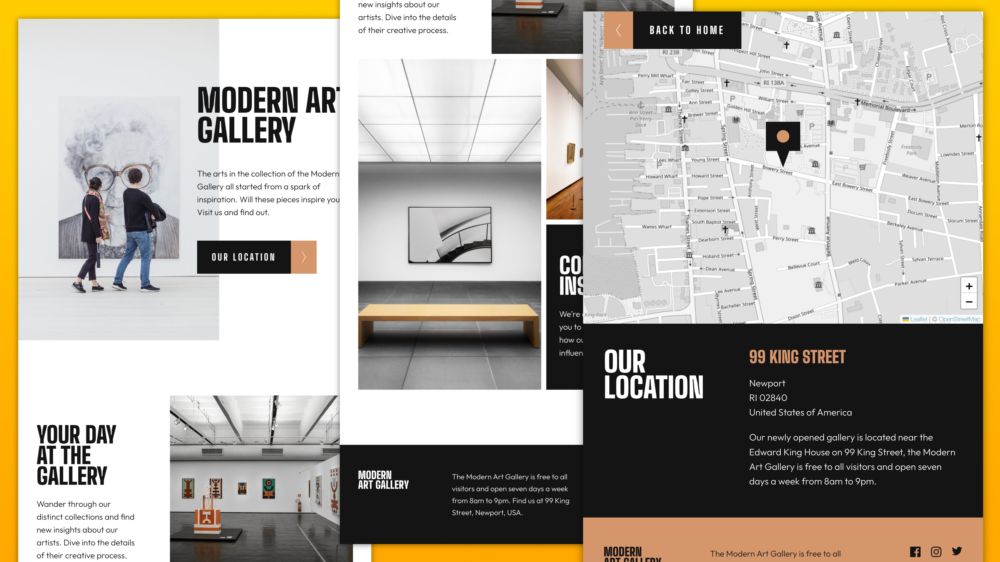
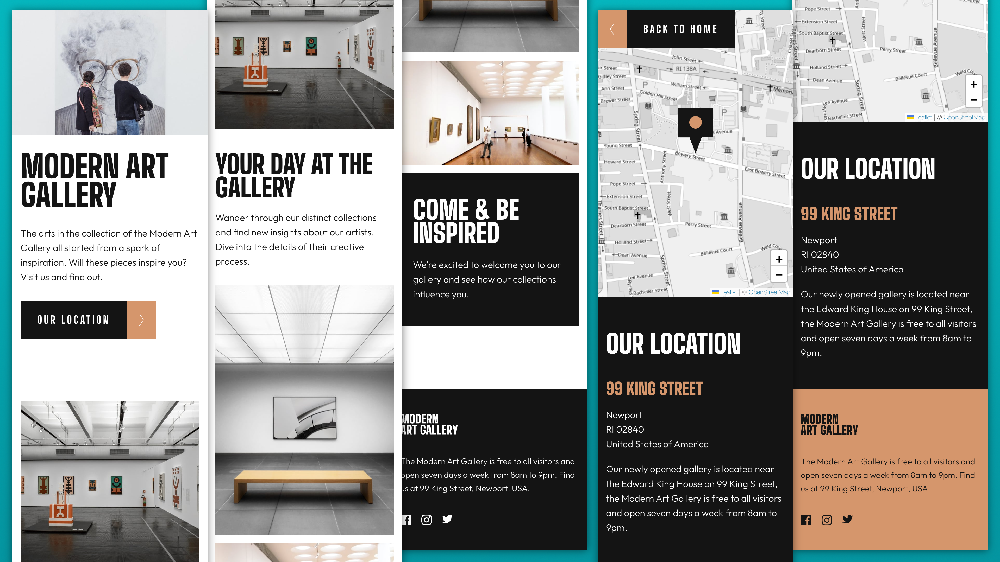

# Frontend Mentor - Art gallery website solution

[](https://github.com/jefcooper/fem-art-gallery/actions/workflows/static.yml)

Live on Github Pages: https://jefcooper.github.io/fem-art-gallery

This is a solution to the [Art gallery website challenge on Frontend Mentor](https://www.frontendmentor.io/challenges/art-gallery-website-yVdrZlxyA). Frontend Mentor challenges help you improve your coding skills by building realistic projects.

## Table of contents

- [Overview](#overview)
  - [The challenge](#the-challenge)
  - [Screenshot](#screenshot)
  - [Links](#links)
- [My process](#my-process)
  - [Built with](#built-with)
  - [What I learned](#what-i-learned)
  - [Continued development](#continued-development)
  - [Useful resources](#useful-resources)
- [Author](#author)
- [Acknowledgments](#acknowledgments)

## Overview

### The challenge

Users should be able to:

- View the optimal layout for each page depending on their device's screen size
- See hover states for all interactive elements throughout the site
- **Bonus**: Use [Leaflet JS](https://leafletjs.com/) to create an interactive location map with custom location pin

### Screenshot

#### Desktop




#### Tablet



#### Mobile



### Links

- Solution URL: [Github Repository](https://github.com/jefcooper/fem-art-gallery)
- Live Site URL: [Github Pages](https://jefcooper.github.io/fem-art-gallery)

## My process

### Built with

- Semantic HTML5 markup
- CSS custom properties
- Flexbox
- CSS Grid
- Mobile-first workflow
- LeafletJS map library
- Github Actions
- Github Pages
- npm / vite

### What I learned

- when line-height is less than 1, such as when closely spacing the display font in headings, it is not shown unless the style is also display: block.
- opening the chrome dev tools docked inside to the right side allows narrowing the browser pane to less than 500px without turning on responsive mode (which can have side-effects).
- whitespace: pre-line, all newlines count, even from the tag to the start of text, so starting the text on a new line for readabilty in html will result in extra space in the layout.
- use of srcset with multiple image resolutions for low and hidpi, i.e. @2x images within a picture element and in background-image.
- container at different break-points with differing inline margins.
- transition is added to the button hover to make it less jarring. Because the colors are swapping, it has large visual impact. Slowing down and fading from one to another softens the change and makes it better. Also carried this through to hover on other interactive elements because I liked the effect.
- Testing on Safari, word wrapping is different for my hero title text. The before is not breaking at the desired spot. Am using white-space: pre-line to explicitly set. Since this doesn't work, changing to use a fixed pixel width on the title to get the desired break.
- Moved to having a build toolchain rather than bare files.
- Was previously using Github pages pointing to the root of my git repo. Migrated to using a Github action workflow and deploying from a 'dist' directory created in an explicit build step.
- Refactored multiple css files (3 of them) to a Sass 7-1 architecture structure and include only one main.scss in both pages.
- Changed from using leaflet from a CDN to installing leaflet as an npm dependency and packaging in my dist through vite.
- font-display: swap to allow fonts to show using system fonts while page is still loading. google lighthouse.

### Github Actions Workflow

Since this is the first project for which I'm using an actual build tool. I'm outlining the process. It's easier than it looks, the documentation is a little sparse in places and overwhelming in others.

1. Move to one repo per project. In this case, I split out a subdirectory of my main repo into its own repository on github.
2. Build tooling. Whatever toolchain, the build process on node is the same: npm install (or npm ci), npm run build.
3. For the actual toolchain, I setup a package.json and installed vite and sass as development dependencies.
4. Moved my code and assets directory into a ./src subdirectory to better separate it from build and tooling concerns in the root.
5. Added a vite.config.js file in the project root with options to build to a /dist directory.
6. Edited the package.json to add scripts for "start", "build", and "preview" using vite.
7. Verify that I can 'npm start' without path problems in the code. Check things like absolute and relative paths in url() etc.
8. Verify that 'npm build' puts stuff into a /dist directory as expected.
9. Commit and Switch over to Github console.
10. Go to Github Repository Settings (gear on right/top), then Pages (left hand sidebar)
11. Default is 'Deploy from branch', switch this to Github Actions
12. Choose the static website template
13. Modify the static.yml, 'Upload Artifact' to have with: path: pointing to your dist directory
14. Modify the static.yml, add nodejs, npm build steps:
15. Commit and verify everything builds
16. Go to Pages and verify link to live site is working.

```
jobs:
  # Single deploy job since we're just deploying
  deploy:
    environment:
      name: github-pages
      url: ${{ steps.deployment.outputs.page_url }}
    runs-on: ubuntu-latest
    steps:
      - name: Checkout
        uses: actions/checkout@v3
      - name: Setup Node 16.x
        uses: actions/setup-node@v3
        with:
          node-version: 16.x
          cache: npm

      - name: Install dependencies
        run: npm ci
      - name: Rebuild the dist directory
        run: npm run build
      - name: Setup Pages
        uses: actions/configure-pages@v2
      - name: Upload artifact
        uses: actions/upload-pages-artifact@v1
        with:
        	# this is relative to repository root
          path: './dist'
      - name: Deploy to GitHub Pages
        id: deployment
        uses: actions/deploy-pages@v1
```

### Bugs and Finishing Steps

- ~~Panning in map makes it impossible to scroll on an iphone. Look to turn off panning and retain zoom. Also maybe limit zoom range.~~
- ~~Review accessibility with keyboard and voiceover.~~

### Useful resources

- https://developer.mozilla.org/en-US/docs/Web/CSS/white-space
- https://stackoverflow.com/questions/35172256/why-cant-we-set-line-height-less-than-1-for-span-element
- https://dev.to/ingosteinke/responsive-background-images-with-image-set-the-srcset-for-background-image-259a
- https://pixboost.com/blog/optimising-images-for-high-dpi-displays/
- https://onestepcode.com/leaflet-markers-svg-icons/
- https://stackoverflow.com/questions/60428521/change-color-of-leaflet-map
- https://leafletjs.com/examples/accessibility/
- https://kiranworkspace.com/sass-architecture/
- https://sass-guidelin.es/
- https://github.com/KittyGiraudel/sass-boilerplate
- https://css-tricks.com/

#### Tooling

- https://www.joshwcomeau.com/css/custom-css-reset/
- https://leafletjs.com/
- https://svg-sprite-generator.vercel.app/
- https://medium.com/swlh/better-ways-to-organise-css-properties-9a066e7ded62

#### Unsplash

- https://unsplash.com/@ryanstefan
- [Hero Image](https://unsplash.com/photos/5K98ScREEUY)
- https://unsplash.com/@robin_schreiner
- [Art gallery bench](https://unsplash.com/photos/YKE4zTW5lic)

#### My Codepens

- [My White/Black text experiment in Codepen]()
- [Leaflet Experiment](https://codepen.io/jefcooper/pen/JjBKoOB)
- [.container](https://codepen.io/jefcooper/pen/GRBqrQG)
- [.visually-hidden](https://codepen.io/jefcooper/pen/yLqJOvx)

## Author

- Website - [Jeff Cooper](https://jefcooper.github.io)
- Frontend Mentor - [@jefcooper](https://www.frontendmentor.io/profile/jefcooper)

## Acknowledgments
